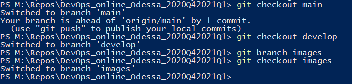
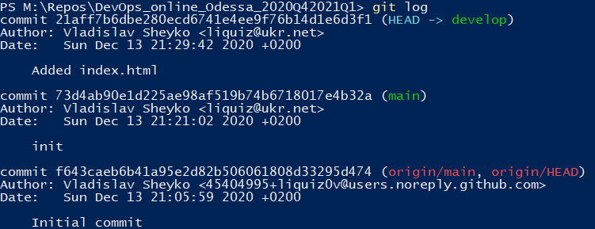

## What is DevOps?
DevOps, at my point of view, is a person, that connects Developers team and Operations team (System administrators), helps automate application delivery processes, and also responsible for application maintanence.

## What I've learned doing this work
I've learned some git commands, mastered branching skills and merge conflicts resolving.

## Images of doing the work

