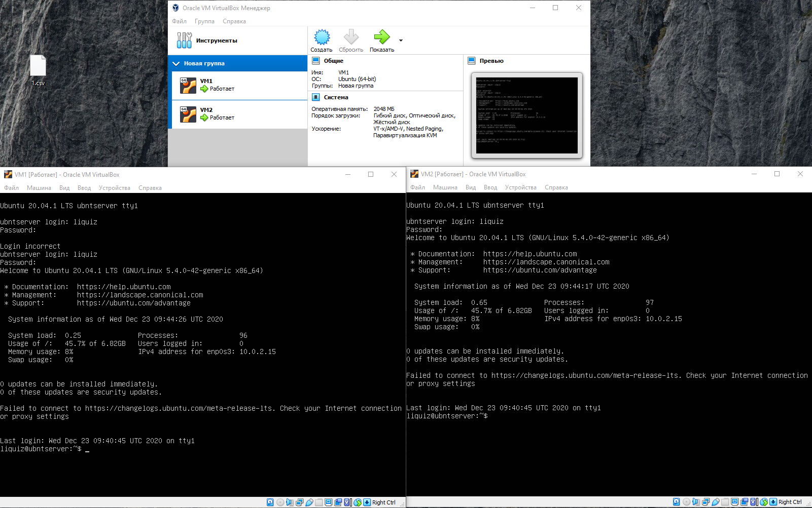
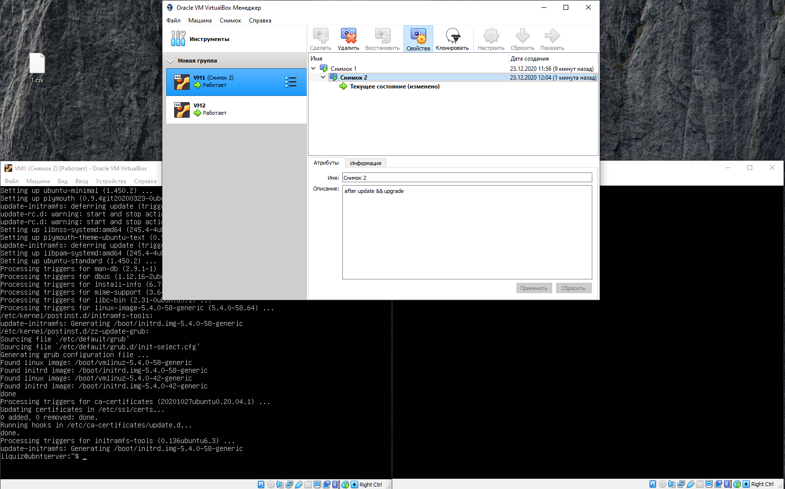
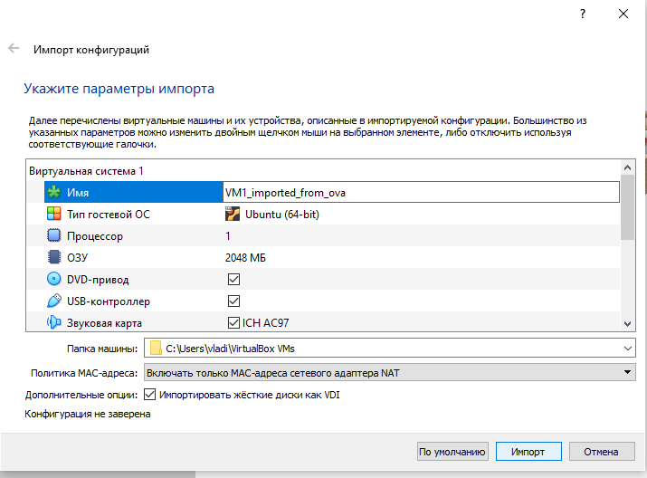
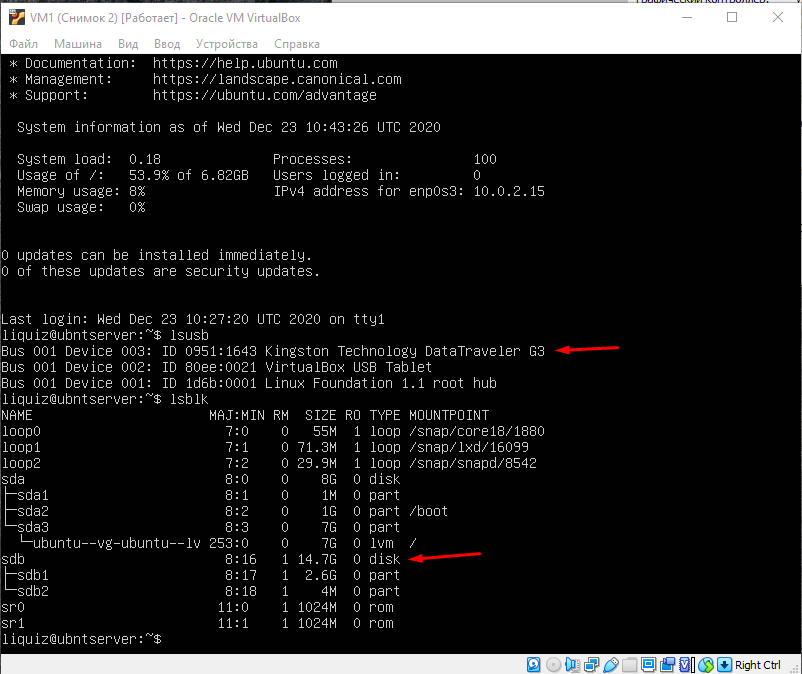
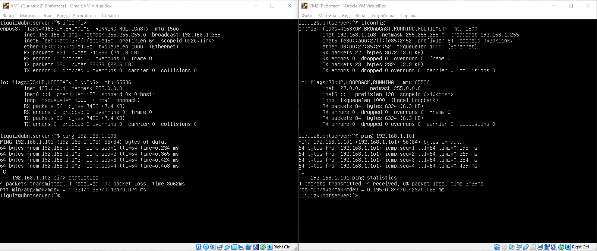
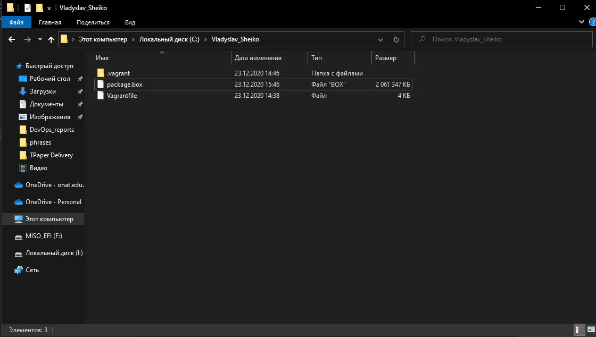

## Part 1. Hypervisors.
Q: What are the most popular hypervisors for infrastructure virtualization?
A: There is a many hypervisors, but only few of them are used mainly, so it's KVM, Hyper-V and Oracle.

Q: Briefly describe the main differences of the most popular hypervisors.
A: 
KVM in comparison to other hypervisors produces direct access to physical resources.
Hyper-V has a nested virtualization and cluster rolling.

## Part 2. Work with Virtualbox.
I have created some screenshots of my task completion, and I have attached them below.

Task 1.6

Task 1.7

Task 1.8

Task 2.2

Task 2.4

Table of possible connections:
 - Via NAT
 - Via Network Bridge
 - Via Virtual host-only adapter

## Part 3. Work with Vagrant.

Task 3.8
