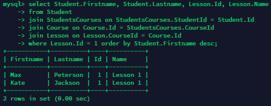
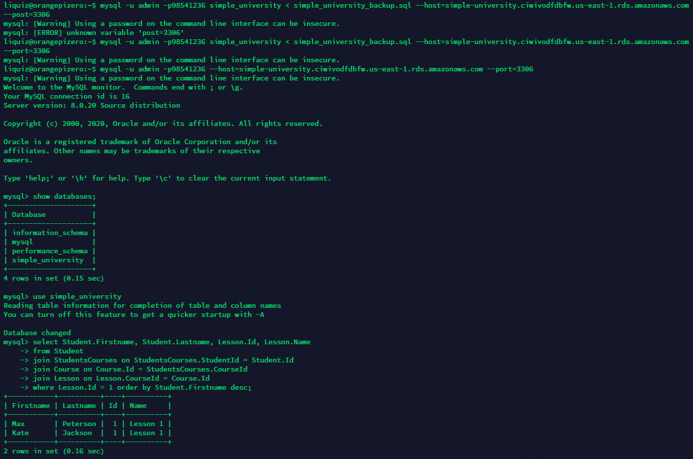

# Task 3.1

I have created here my own database schema, created simple query (wou can check it on query.sql) and also made a backup, and succesfully restored it on RDS. I have made some screenshots, and created some queries, so you can check them in folder.

## Task 3.1.6

## Task 3.2.15
