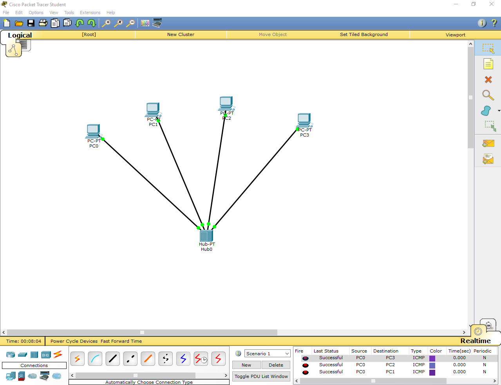
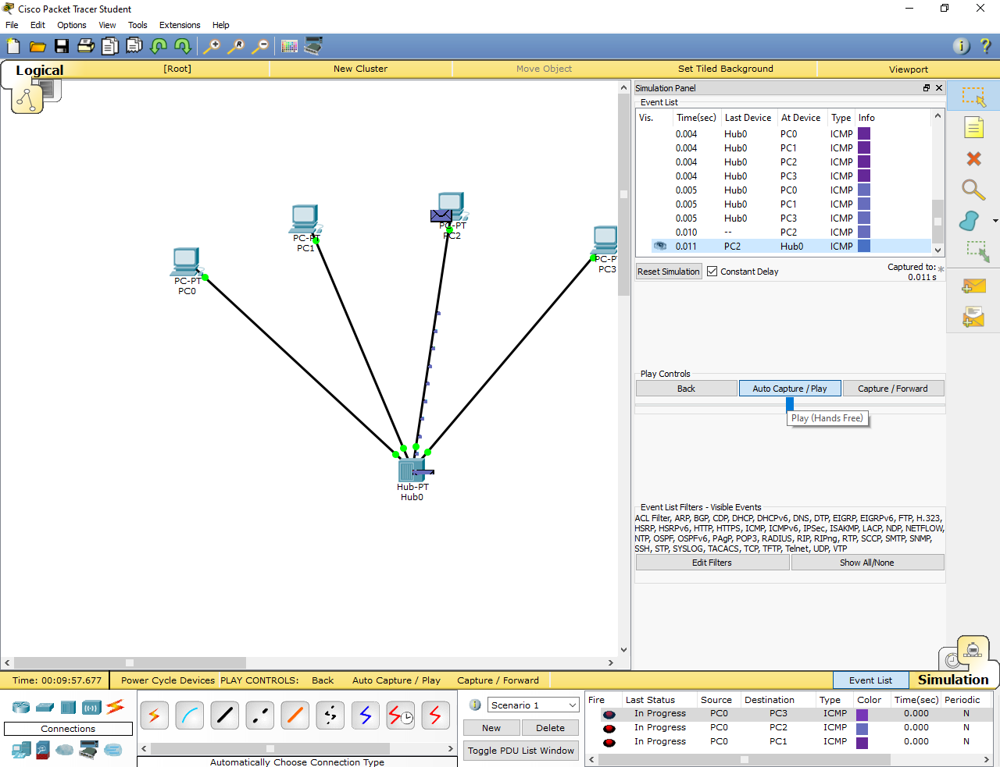
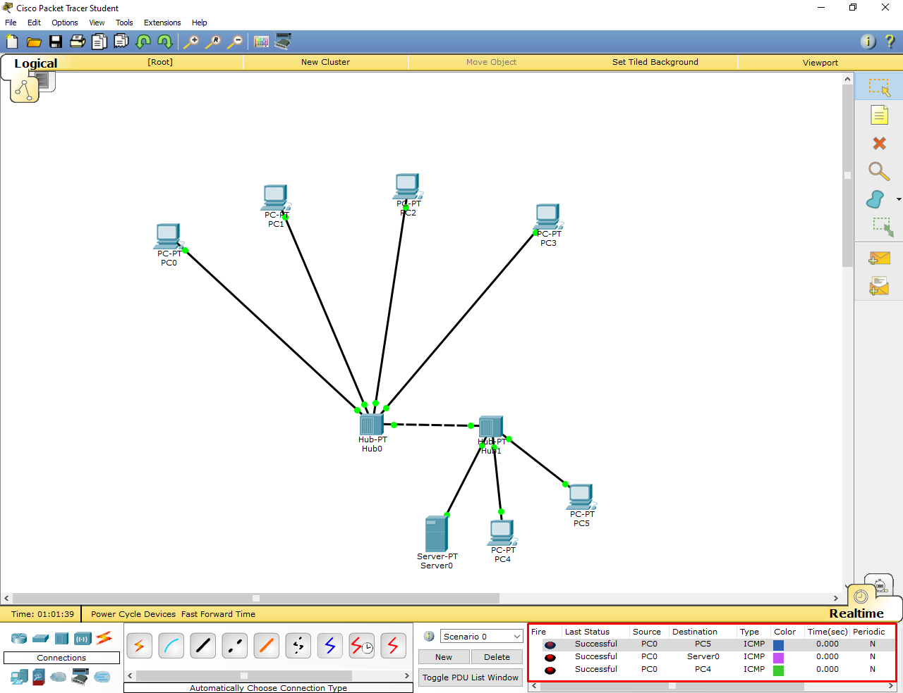
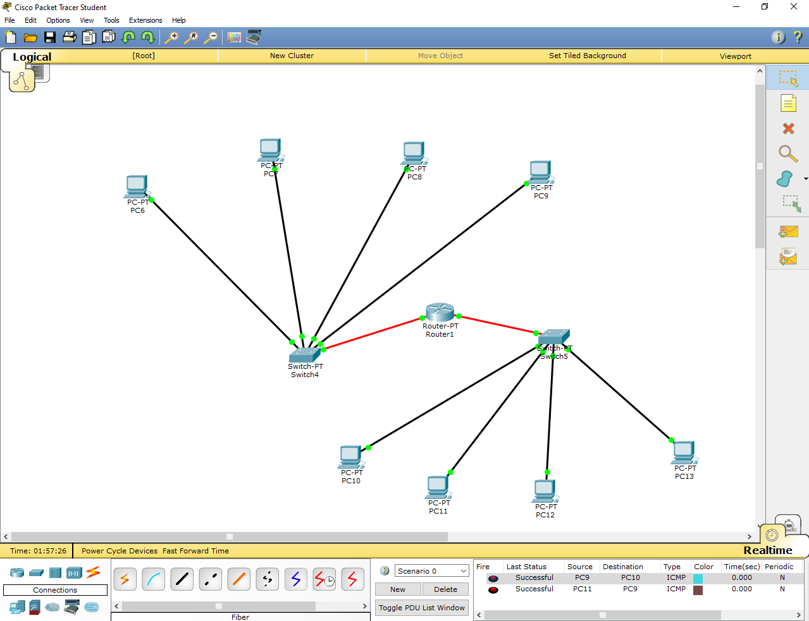

## Task 4.1

I have done this task, screenshots are attached below. The most interesting task for me was the creation of static routes on router.

## Task 4.1.4

## Task 4.1.7

## Task 4.1.11

## Task 4.1.22

