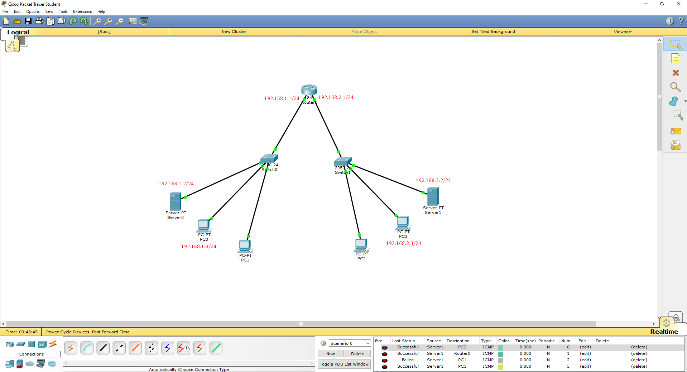
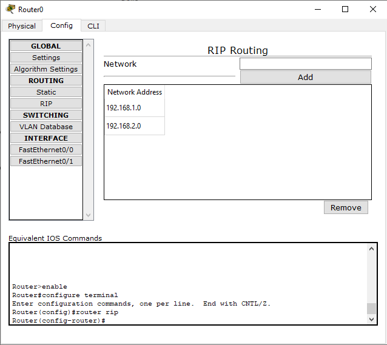
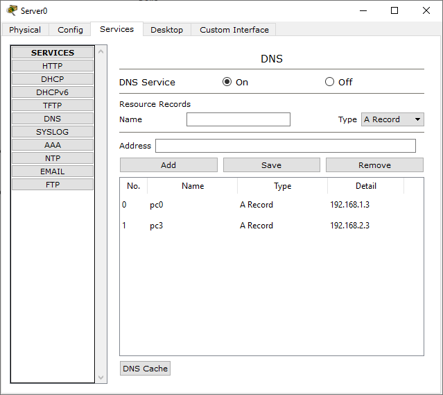
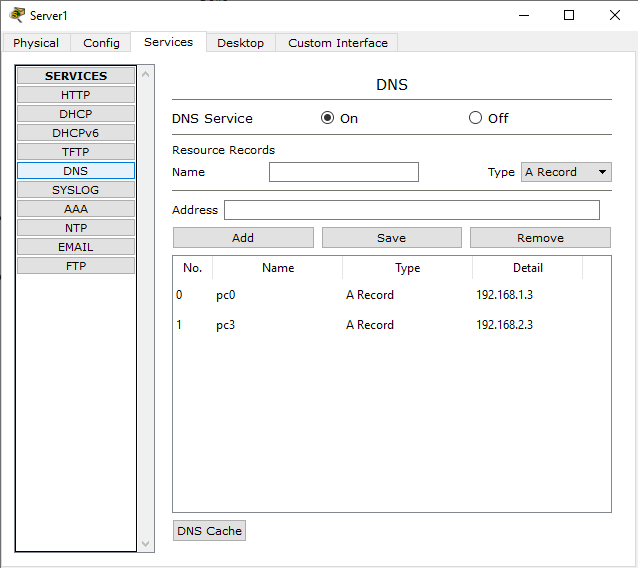
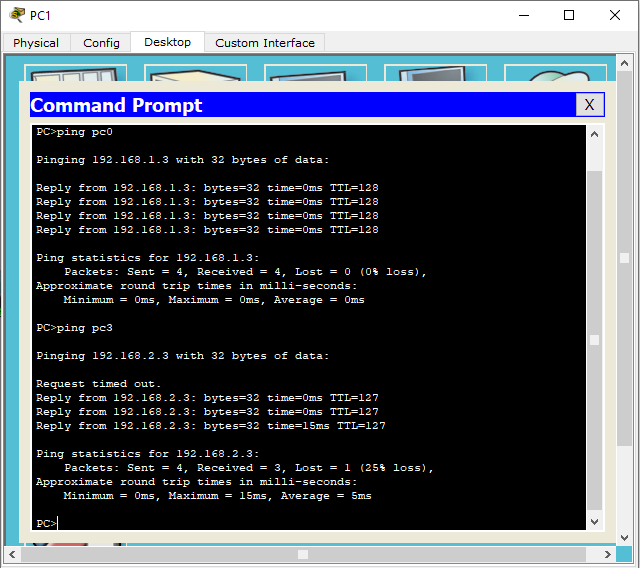
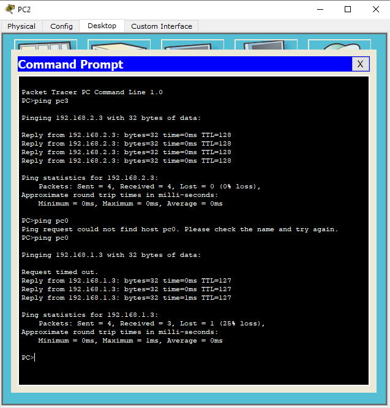

## Task 4.4

### Task 4.4.1

This task was previously done in [Task 4.3](https://github.com/liquiz0v/DevOps_online_Odessa_2020Q42021Q1/blob/main/m4/Task4.3/Readme.md)

### Task 4.4.2

Here some screenshots that's describing my work

