### Task 5.1 (Part 1)

I have learned a lot in this Task, and I have attached some screenshots of work completion below.

#### Task 5.1.2

Changes, made from command passwd, will be made in /etc/passwd file
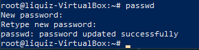

#### Task 5.1.3
Task 5.1.3 can be completed using commands: 
"cat /etc/passwd" - to show users, and their home dirs
"cat /home/{userdir}/.history" - to show their command history

#### Task 5.1.4
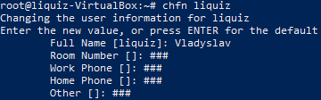

#### Task 5.1.5
I'll describe here using of keys chfn and passwd

chfn is used for change real name and user info. 
Here's little example of keys: 
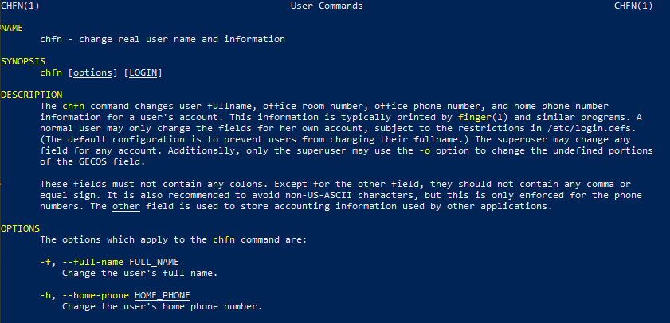

passwd is used for changing password
I'll attach here a list of available keys for this command.
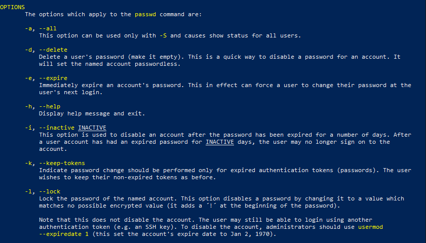

#### Task 5.1.7
finger command lets you show info about user, here's example output of this command:
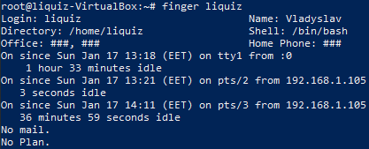

#### Task 5.1.8
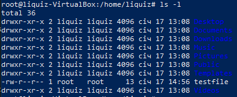

### Task 5.1 (Part 2)

#### Task 5.2.1
In this task I have mastered a tree command with wildcard masks.
Here's example of command that i've been using:
tree -a -P 'C*|c*'

#### Task 5.2.2
This task can be done using file command, and here's little example of it:
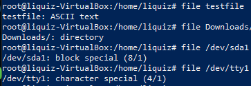

#### Task 5.2.3
We can do this using cd ~ command, which returns you to your home dir

#### Task 5.2.4
Here's a bit of examples of ls command with different keys:
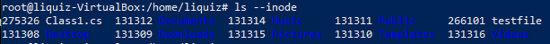
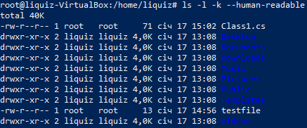

Difference between 'ls -a' and 'ls -l' is in output.
ls -a outputs all files, even hidden files, that starts with dot (.)
ls -l outputs file listing in long way.

#### Task 5.2.5
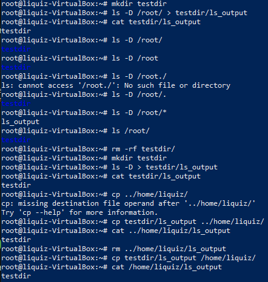

#### Task 5.2.6
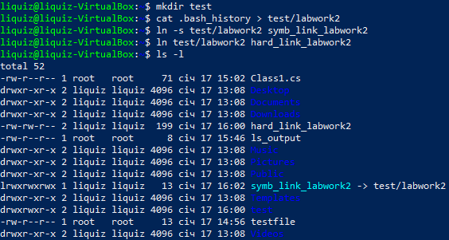
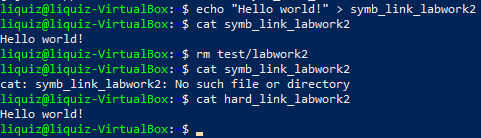

When we change data by symbolic link, it will change in file itself, but if we remove initial hard link to file and try to read file by symbolic link we'll get no access to it. It happen because symbolic link is always assigned to some hard link. Hard links are simply pointers to file on physical device, and if we delete this hard link we lose access point to file. And if we delete all hard links we will lose file itself.

#### Task 5.2.7
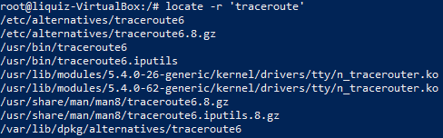

#### Task 5.2.8
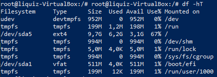

#### Task 5.2.9
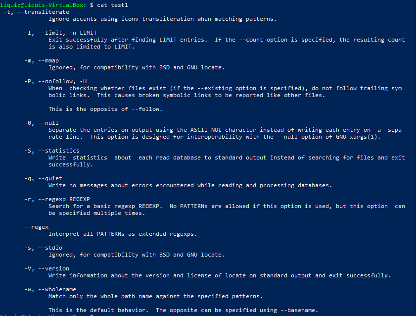
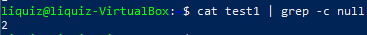

#### Task 5.2.10
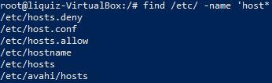

#### Task 5.2.11
We can do this task using find command as:
find /etc/ -name 'ss*'
And also, we can use grep with ls -R:
ls -R | grep -G "ss"

#### Task 5.2.12
We can complete this task using
ls -lR | more
or
ls -lR | less

#### Task 5.2.13
In linux, there are several device types, and we can inspect them in /dev directory, using ls -l
Types of devices are:
c - character
b - block
p - pipe
s - socket
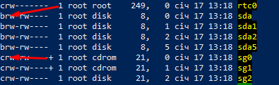

#### Task 5.2.14
We can use file command, to show a file type.
Example of this command is shown below:
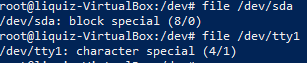
This command reads filetypes from /etc/magic file, and from compiled /usr/share/misc/magic.mgc, or the files in the directory /usr/share/misc/magic if the compiled file does not exist.

#### Task 5.2.15
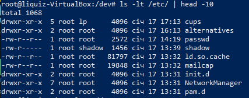