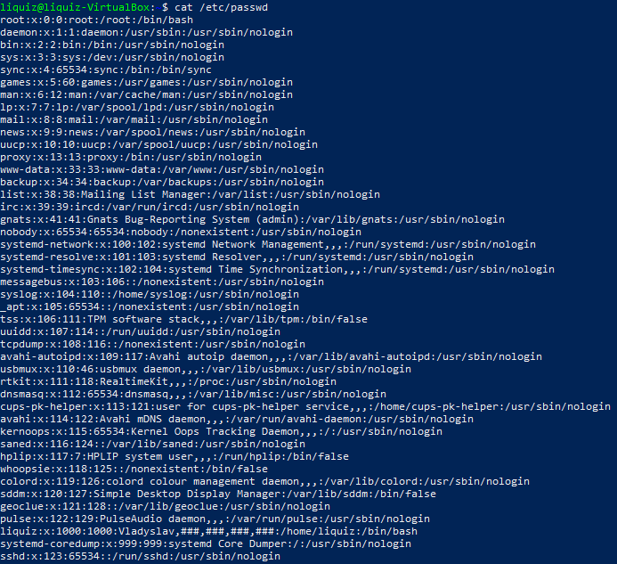
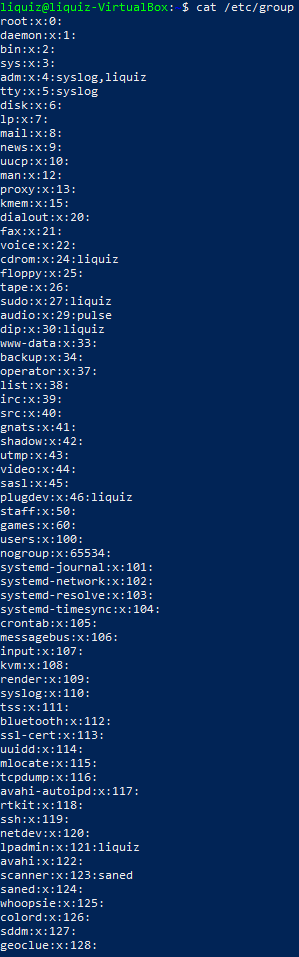
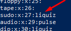
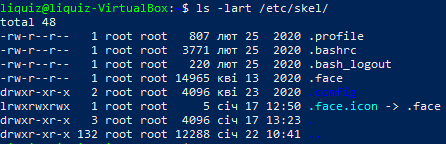
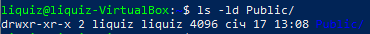
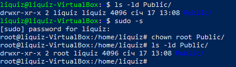
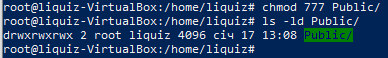

### Task 5.2

#### Task 5.2.1
/etc/passwd and /etc/group are made for password and group management of system's users and groups.
The contents of /etc/passwd are:
User name  
Encrypted password  
User ID number (UID)  
User's group ID number (GID)  
Full name of the user (GECOS)  
User home directory  
Login shell  
And contents of /etc/group:  
group_name: It is the name of group. If you run ls -l command, you will see this name printed in the group field.  
Password: Generally password is not used, hence it is empty/blank. It can store encrypted password. This is useful to implement privileged groups.  
Group ID (GID): Each user must be assigned a group ID. You can see this number in your /etc/passwd file.  
Group List: It is a list of user names of users who are members of the group. The user names, must be separated by commas.  

  
  

#### Task 5.2.2
UID is stands for User ID, and it's ranges are:  
UID 0 (zero) is reserved for the root.  
UIDs 1–99 are reserved for other predefined accounts.  
UID 100–999 are reserved by system for administrative and system accounts/groups.  
UID 1000–10000 are occupied by applications account.  
UID 10000+ are used for user accounts.  

This can be defined in /etc/passwd

#### Task 5.2.3
GID is stands for Group ID, and it's ranges are:  
GID 0 (zero) is reserved for the root group.  
GID 1–99 are reserved for the system and application use.  
GID 100+ allocated for the user’s group.  

This can be defined in /etc/group

#### Task 5.2.4
It can be found in file /etc/group.  

  

#### Task 5.2.5
adduser {username}  

#### Task 5.2.6
We can change username using usermod command, also we can set new home directory, and we need to specify old username.  
example of command is usermod -l <newname> -d /home/<newname> -m <oldname>  

#### Task 5.2.7
skel_dir is a directory, which is used to initiate new user directory when user is created.
Here's quick example of it.  
  

#### Task 5.2.8
This task can be done using userdel command, and for complete deletion from system wwe can use
userdel --remove <username>  
or  
userdel -r <username>  

#### Task 5.2.9
We can use usermod for this.  
Examples are:  
usermod -L <username>  
and for unlock:  
usermod -U <username>  

#### Task 5.2.10
passwd --delete <username>  

#### Task 5.2.11
ls -ld <directory>  
  
Fields here:  
Permissions, hard links, owner name, owner group, size (bytes), last modification date, dir name.

#### Task 5.2.12
Possible access rights are r(read), w(write) and x(execute). The main acronym for access rights is permissions (perms).  

#### Task 5.2.13
Permission class  

#### Task 5.2.14
Wwe can use chown to give file ownership and chmod to change access mode
Screenshots of terminal are shown below.  
  
  

#### Task 5.2.15
We can use octal representation of rights, for example, I've been using 777 as rwx rwx rwx for change permissions command in previous task, so It's an example of this type of perms.  
Also, this octal number, (in our case it's 7) can be calculated using binary numbers. For example 3 in binary will be 011, so perms will be -wx accordingly. Another example 6 -> 110 -> rw-.  
umask is stands for "user mask" and it's simply stands for user's permissions on a file or a directory. Example of this can be --wx--x--x or drw-------.  

#### Task 5.2.16
A Sticky bit is a permission bit that is set on a file or a directory that lets only the owner of the file/directory or the root user to delete or rename the file. No other user is given privileges to delete the file created by some other user.  

#### Task 5.2.17
Script files should be executable. (ugo+x)  
