## Task 5.3

### Task 5.3.1

#### Task 5.3.1.1
Here's the list of process states, from man ps:  
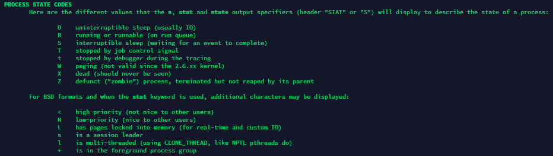  
#### Task 5.3.1.2
pstree is a command that allows to output process list in a tree view.  
Here's the example of highlighting current process:  
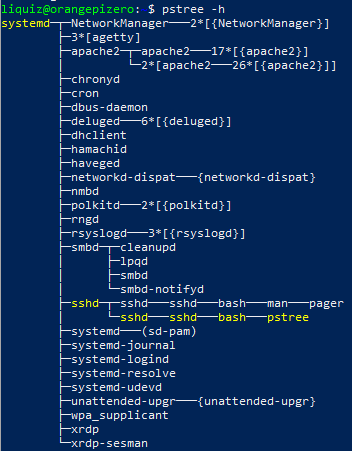  
#### Task 5.3.1.3
Proc filesystem is located in /proc and is a filesystem with virtual files, that represents info about system (like processes, statistics, etc.)  
Here's an example of this: (I've been using procinfo command to get this)  
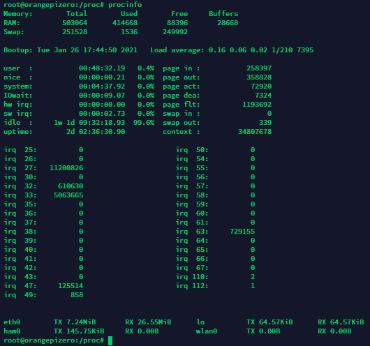  
#### Task 5.3.1.4
We can use here lscpu command, but it's not only way, we can take this info from /proc folder too.  
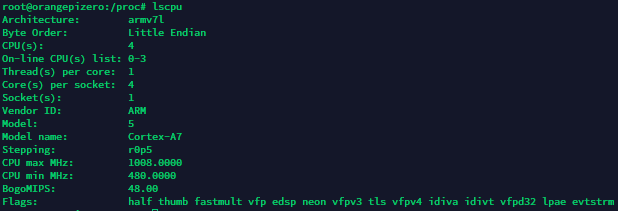  
#### Task 5.3.1.5
Here it is:  
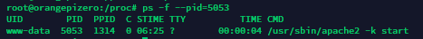  
#### Task 5.3.1.6
Kernel processes has ppid=2 (parent process id) and user processes has different value of this.  
#### Task 5.3.1.7
I'll use my process list from task 1. Let's get some processes to desribe!  
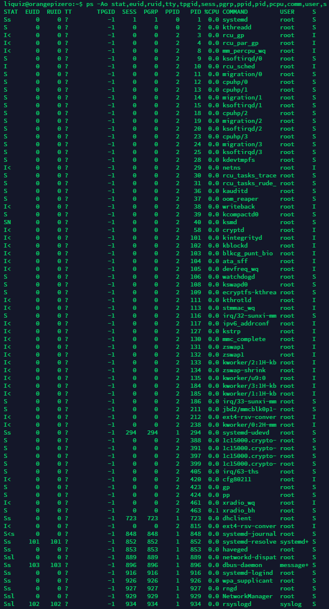  
And here we can see bunch of processes, with different states, so:  
Ss - Uninterruptable sleep, session leader;  
S - Uninterruptable sleep;  
I< - That's not listed in docs, but it stands for IDLE, withs high priority;  
I - IDLE;  
SN - Uninterruptable sleep, low priority;  
S<s - Uninterruptable sleep, high priority, session leader;
#### Task 5.3.1.8
We can use here  
ps -U {username}  
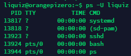  
#### Task 5.3.1.9
htop, top  
#### Task 5.3.1.10
top command displays information about processes, current system load, memory status, uptime.  
#### Task 5.3.1.11
We can use top -u {username} for this.  
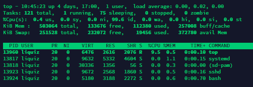  
or, alternetevly, we can launch top, then press F ~~to pay respect :)~~, and then choose USER field from dynamic menu, and put username there.  
It will cause the same result at end.  
#### Task 5.3.1.12
I'll take the description from top's docs:  
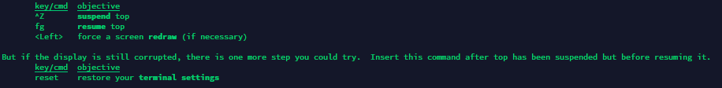  
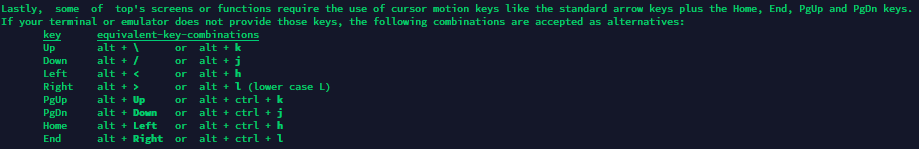  
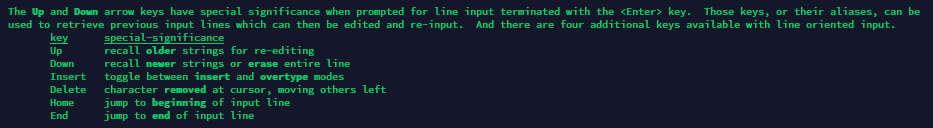  
#### Task 5.3.1.13
To sort output of top we can use this F dynamic menu, and then sort output by listed variables.  
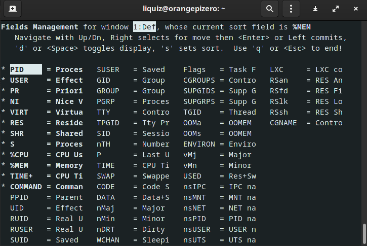  
#### Task 5.3.1.14
We can use nice and renice to set priority to some process.  
#### Task 5.3.1.15
Sure, we can. Just open top, press r, input pid, and put a renice value to it.  
#### Task 5.3.1.16
kill is a command, which's main purpose in seding signals to processes. Here's the list of available signals:  
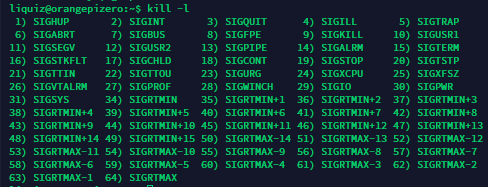  
And here's the example of usage:  
kill -s {signalName} {PID}  
kill -s SIGTERM 58476  
#### Task 5.3.1.17
These commands are used for jobs management. Here's the example of usage:  
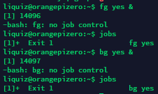  

### Task 5.3.2

Those task was implemented in two sides (Linux host - Windows client, and Linux client - Windows host)  

#### Task 5.3.2.1
First of all, let's install our OpenSSH to Windows.  
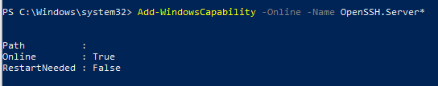  
Then I probably want to generate some ssh public/private key-pair:  
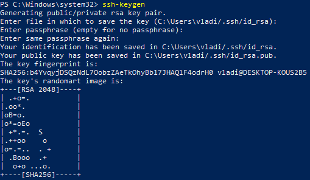  
Then copy it to VM, and put it into authorized_keys:  
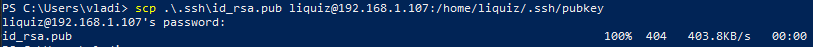  
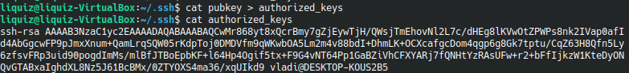  
And let's check ssh connection:  
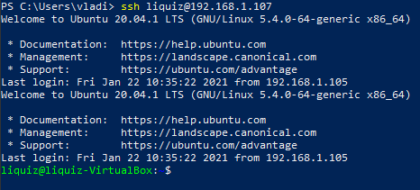  
#### Task 5.3.2.2
In this step I want to move sshd port to 22000, restrict root logins, restrict logins with password (only ssh key is allowed). So, I need to configure ssh for this. I have attached my sshd config below.  
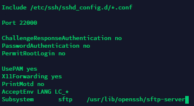  
And, let's check, is the config were successfully applied?  
Let's restart sshd, and check it's status then:  
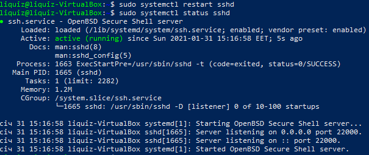  
As we can see, port was changed successfully, so, let's try to log in!  
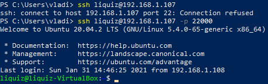  
And we successfully logged in (with ssh key)  
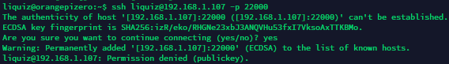  
... and succesfully failed to login in usual way (login-password)  
#### Task 5.3.2.3
According to docs we can set following types of encryption:  
The possible values are “dsa”, “ecdsa”, “ed25519”, or “rsa”.  
We have implemented already rsa, so let's implement dsa and ecdsa.  
Let's generate keys:  
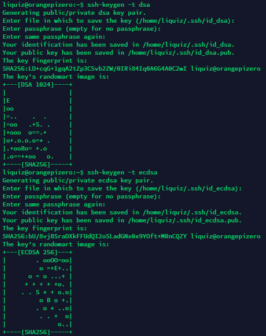  
And put them into our Windows OpenSSH server's authorized_keys file:  
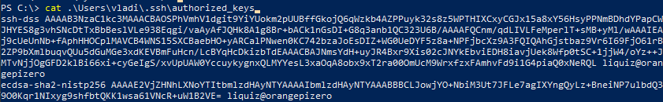  
And then, let's try to login using our keys:  
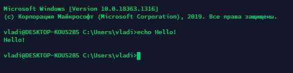  

#### Task 5.3.2.4
I have implemented this task, and attached screenshots below.  
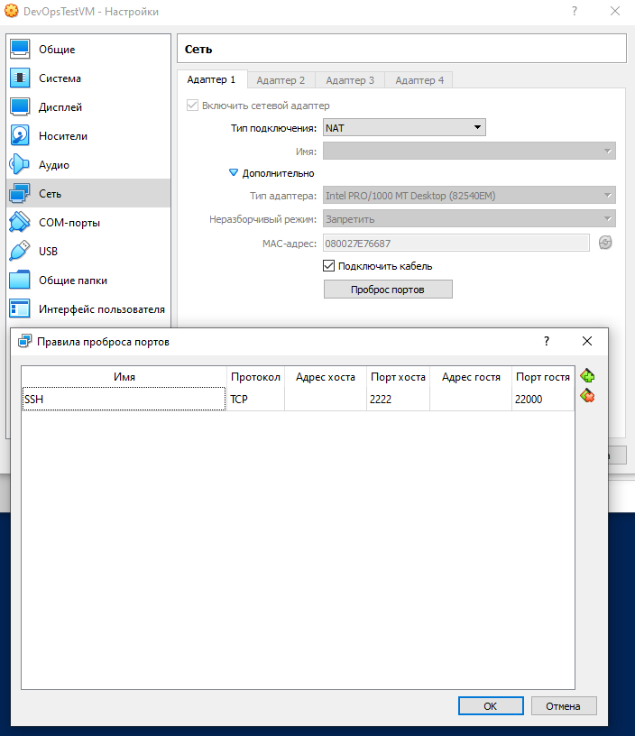  
And let's try to login using ssh to localhost  
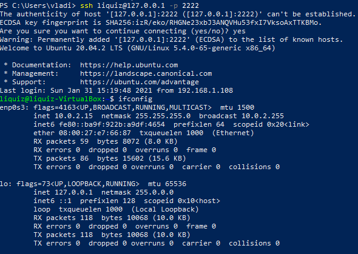  
As we can see, our setup is fully functional!  

#### Task 5.3.2.5
To do this task, I have installed wireshark, and all my moves were done in Windows.  
Now we will analyze ssh connection to VM behind NAT (port forwarded to local PC).  
Let's capture packets on Windows PC's loopback interface using Wireshark:  
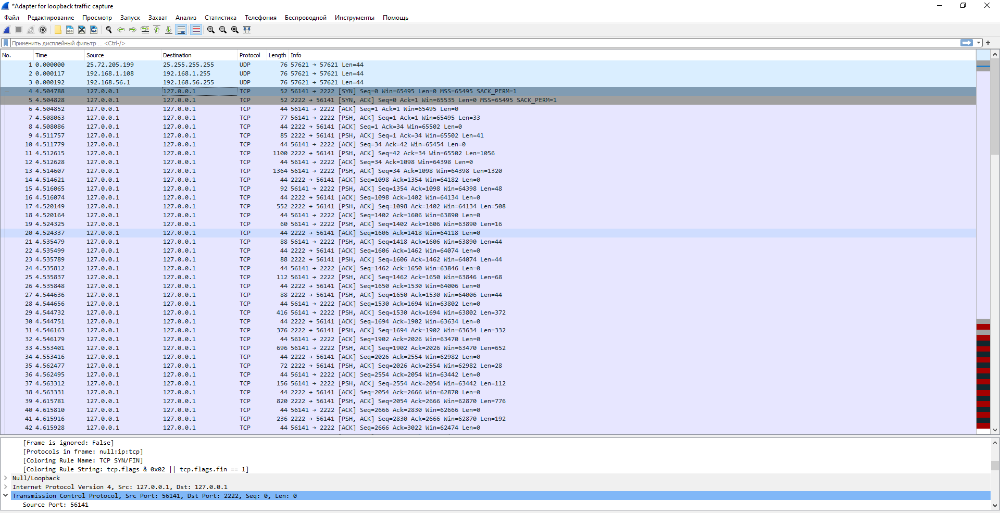  
Here we can see Default SYN/ACK flag pair, also packets with PSH flag also there. Let's analyze them:  
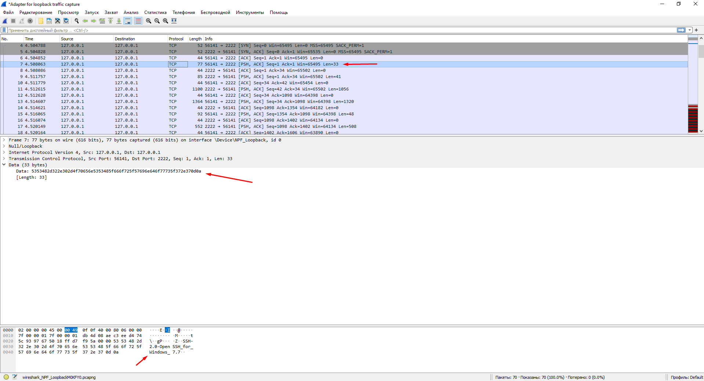  
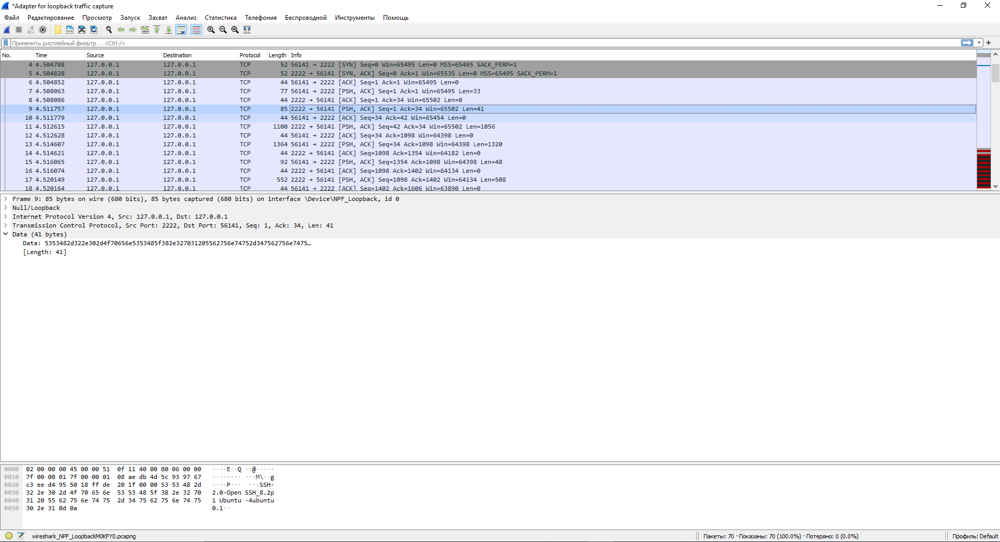  
Here we can see exchange about servers' names  
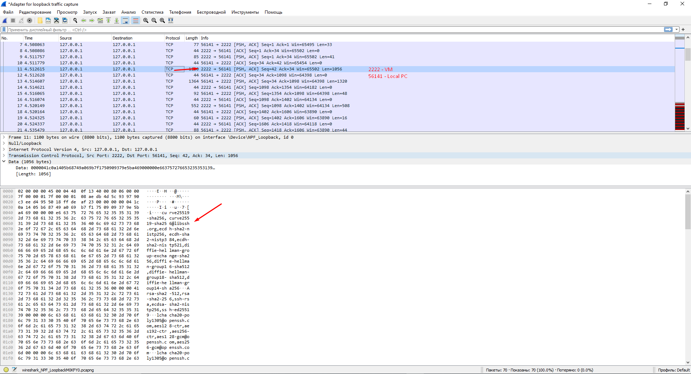  
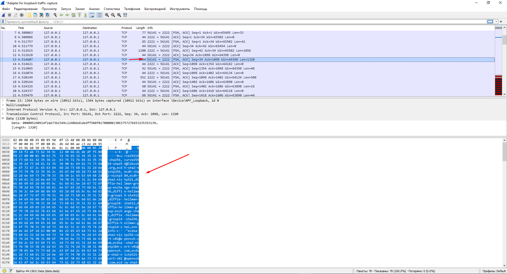  
Here we can clearly see exchange about supported encryption algorithms.  
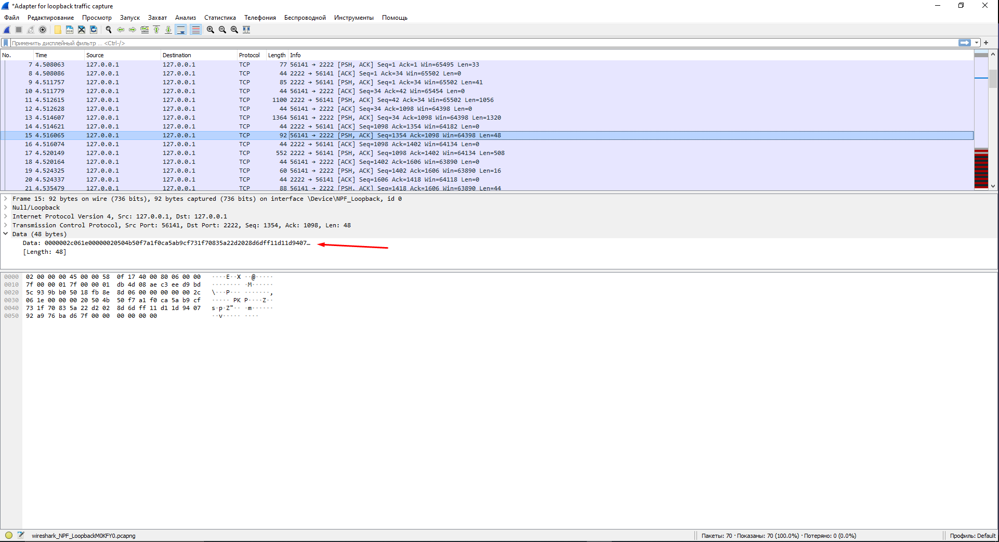  
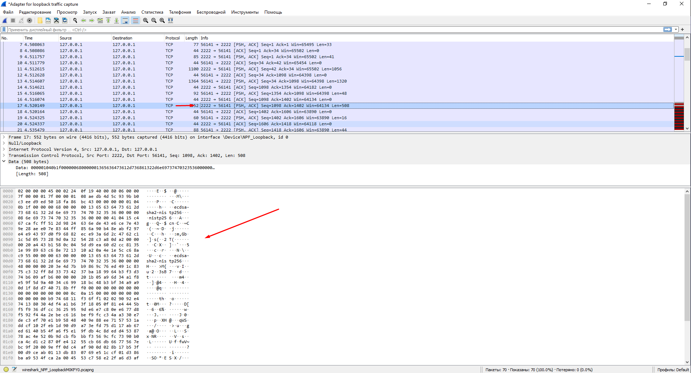  
Then, next two PSH packets are about exchanging keys.  
And all other packets is an encrypted data of ssh connection.  
Full dump you can find [Here](./files/ssh_exchange.pcapng)